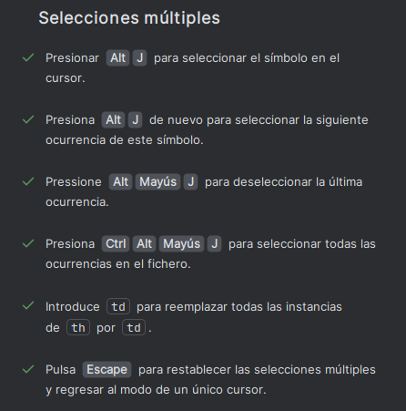
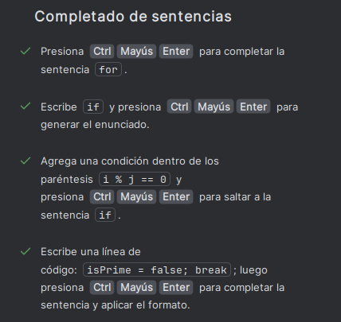
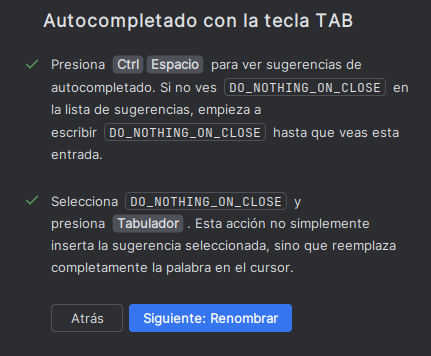
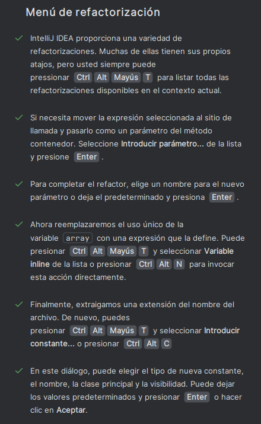
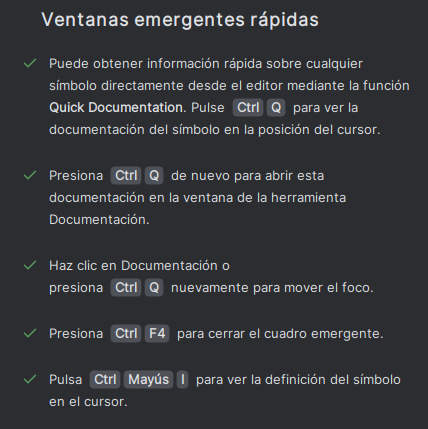
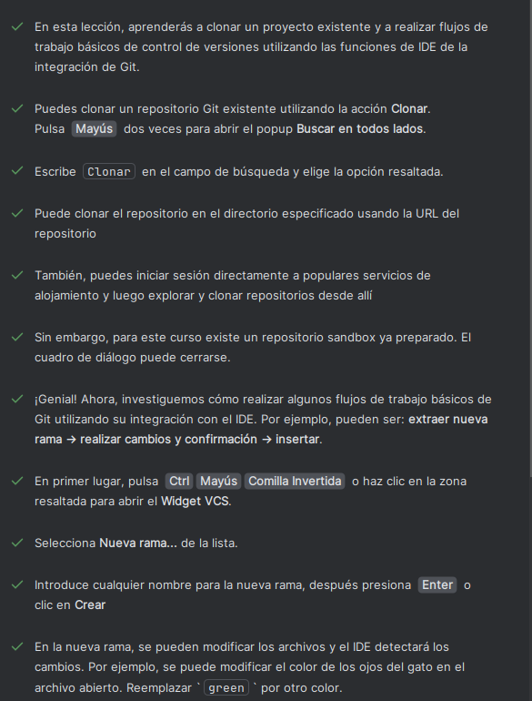
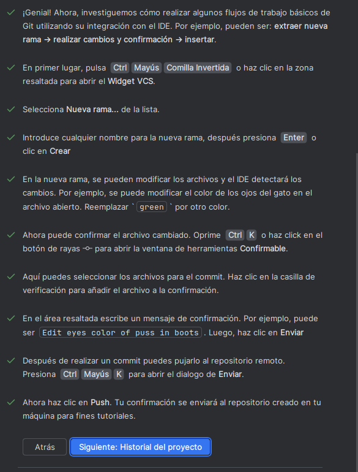
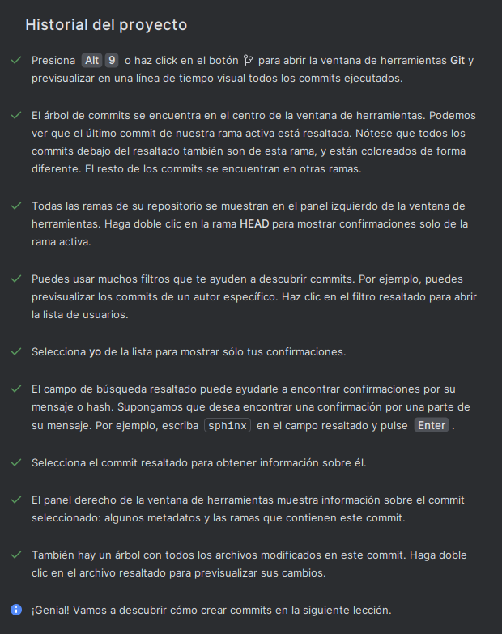

# Atajos interesantes en IntelliJ IDEA

## Acciones contextuales
- `ALT + ENTER`: Acciones contextuales
- `Mayus + Mayus`: Buscador de palabra marcada y más opciones
- `Alt + 1`: Abrir panel archivos
- `Mayus + F10`: RUN
- `Mayus + F9`: Debugger
- `Ctrl + Mayus + A` (O doble Mayus): Ir a Acción
- `Ctrl + q`: Vista previa de documentos de la clase seleccionada
- `Ctrl + Alt + Mayus + n`: Buscar un método o variable global
- `Ctrl + Mayus + n`: Buscar un archivo
- `Ctrl + Espacio`: Ver valor de una constante/variable

## Selección de texto
- `Ctrl + W`: Seleccionar palabra
- `Ctrl + W` x2: Seleccionar texto / en caso de estar sobre un `if` por ejemplo, selecciona todo el bloque
- `Ctrl + W` x3: Añadir comillas al texto
- `Ctrl + Mayus + W`: Hacer una selección solo de los argumentos

## Comentarios
- `Ctrl + /`: Comentar una línea (`//`)
- `Ctrl + Mayus + /`: Comentar más de una línea (`/*...*/`)

## Edición de líneas
- `Ctrl + D`: Duplicar una línea
- `Ctrl + Y`: Borrar la línea actual
- `Ctrl + Mayus` (flecha arriba/abajo): Mover una línea para arriba o para abajo

## Navegación y plegado de código
- `Ctrl -`: Cerrar función o parte del código actual
- `Ctrl +`: Abrir función o parte del código actual
- `Ctrl + Mayus -/+`: Contraer o expandir todas las acciones del archivo

## Funciones avanzadas
- `Ctrl + Alt + Mayus + B`: Rodear el fragmento de código seleccionado con algún código de plantilla
- `Ctrl + Mayus + Suprimir`: Deshacer la última acción

## HTML

## Sugerencias y formato de código
- `Ctrl + Mayus + Espacio`: Sugerencias de código
- `Ctrl + Mayus + Enter`: Agregar `{}` después de inicialización de una estructura o simplemente escribir `if` + hacer atajo y se hace automáticamente
- `Tab`: Reemplazar lo seleccionado

## Refactorización
- `Mayus + F6`: Renombrar una variable o lo que sea y que se cambie en todas las que se llaman igual
- Seleccionar lo que será una nueva variable + `Ctrl + Alt + V`: Crear una nueva variable y reemplazar en cada aparición con esta
- Seleccionar bloque de código + `Ctrl + Alt + M`: Crear una nueva función que hace lo de ese bloque y la llama en ese mismo lugar

## Formateo de código
- `Ctrl + Alt + Mayus + L`: Formatear código
- `Ctrl + Q`: Obtener información

## GIT

